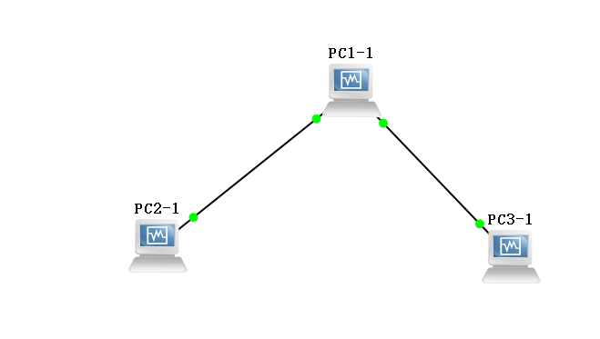

# 1.首先为PC1增加相应网卡

```c
sudo ip link eth1 up
```

## 2.使用gns3画连接图




具体配置如上图所示

## 3.具体配置

对pc3:

```c
sudo ip route add 192.168.2.0/24 via 192.168.1.2
```

对pc2:

```c
sudo ip route add 192.168.1.0/24 via 192.168.2.2
```

最后:

```c
echo 1 > /proc/sys/net/ipv4/ip_forward
```

